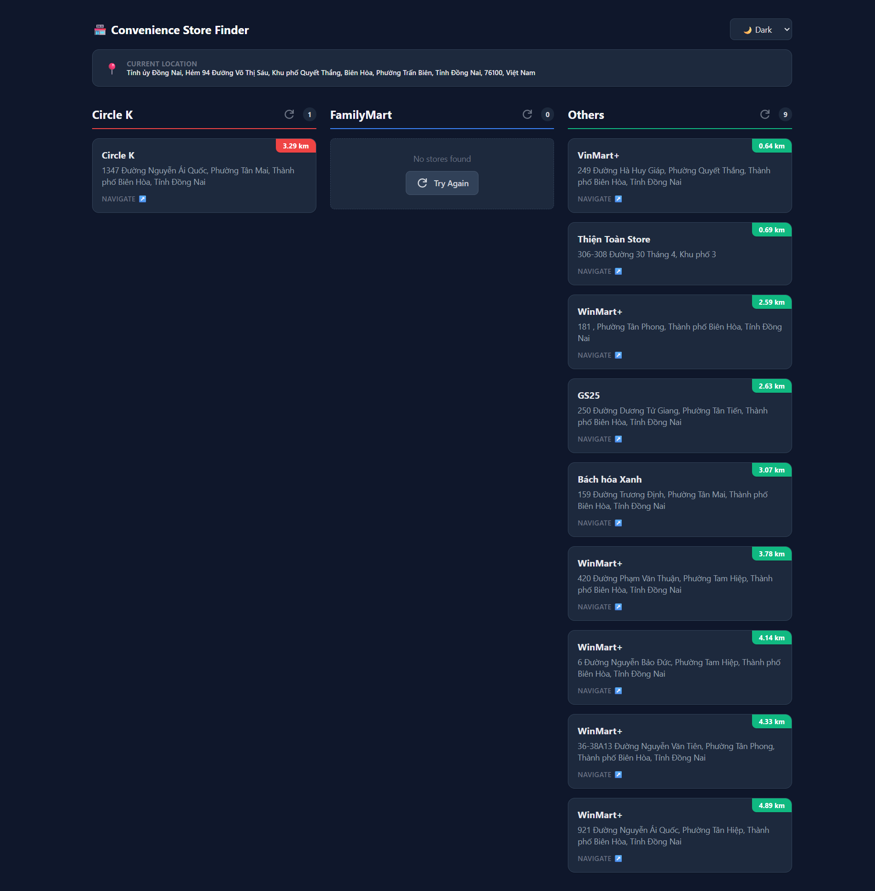
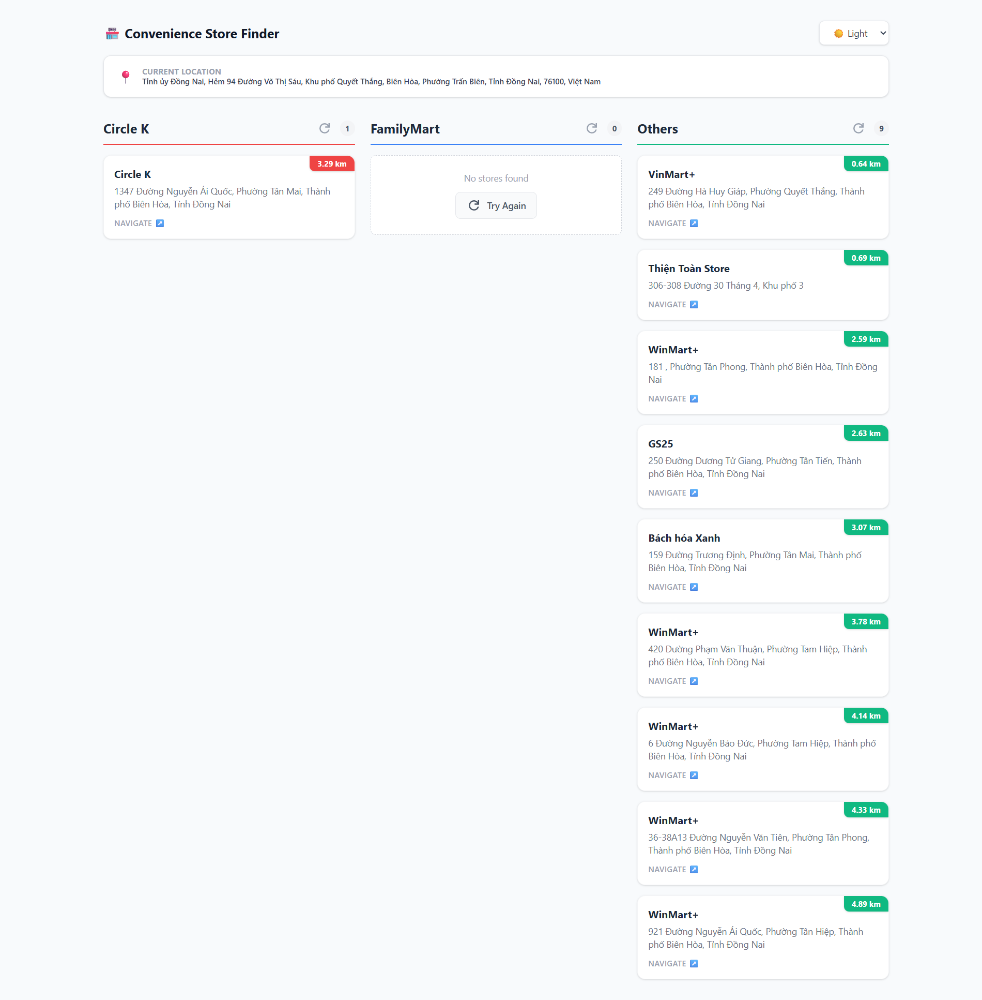
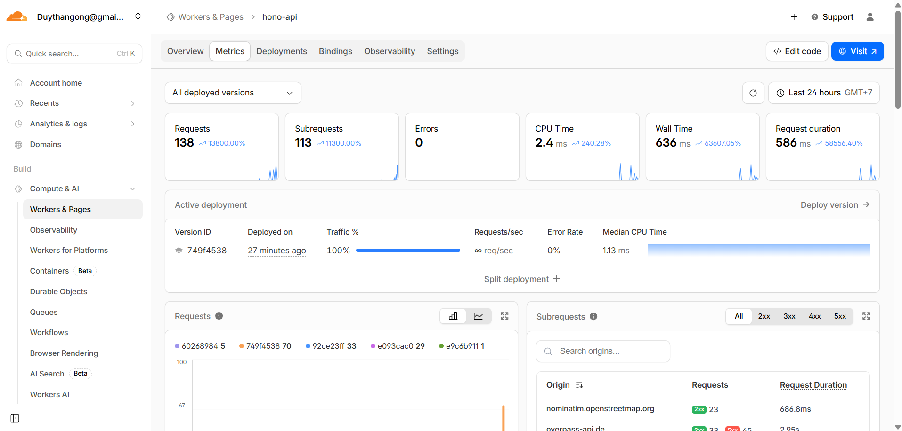

# 🏪 Geographic Store Finder (Monorepo)
A location-based "Convenience Store Finder" application built with HonoJS (deployed on Cloudflare Workers) and Svelte.

This project demonstrates a modern, type-safe full-stack architecture where the frontend and backend share strict TypeScript definitions via Hono RPC, ensuring zero-latency synchronicity between API contracts and client consumption.

🔗 **Live Demo:** [https://geo-app-monorepo-frontend.vercel.app/](https://geo-app-monorepo-frontend.vercel.app/)

## 🚀 The Power of HonoJS
This project leverages HonoJS not just as a router, but as a full-stack framework enabler. Here is why Hono is the core of this architecture:

### 1. 🔗 End-to-End Type Safety (RPC)
- **Hono's RPC (Remote Procedure Call) feature**: Allows us to share the API type definitions directly with the Svelte frontend.

- **No manual types**: No need to write interface such as Store { ... } in the frontend. Just simply import AppType from the backend.

- **Autocomplete everywhere**: When we type client.stores['circle-k'].$get(), TypeScript knows exactly what the response data structure is.

- **Instant Feedback**: If we change a backend controller, the frontend build fails immediately, preventing runtime errors.

### 2. 🛡️ Zod Validation & OpenAPI
- **Built-in @hono/zod-openapi**: Allow us to validate incoming requests and outgoing responses strictly using Zod.

- **Auto-generate Swagger UI**: The /doc and /ui endpoints are automatically created from code. No separate YAML files to maintain.

### 3. ☁️ Cloudflare Native
- **Hono is built on Web Standards**: Making it the perfect companion for Cloudflare Workers (or any other runtime environments).

- **Zero Cold Starts**: Ultra-fast startup times on Cloudflare Worker compared to Node.js containers.

- **c.req.raw.cf Access**: We could access Cloudflare's specific features (like the cf object for geo-location) directly in the context.

## 🛠️ Tech Stack
- **Backend**: HonoJS API running on Cloudflare Workers

- **Frontend**: Svelte 5 (Vite)

- **Data Fetching**: Hono Client (RPC)

- **Docs**: OpenAPI auto generated schema

- **Validation**: Zod schema

- **Geo Data Source**: OpenStreetMap (Overpass API)

- **Styling**: Tailwind CSS v4

## ✨ Features
- 📍 **Real-Time Geolocation**: Automatically detects user location via Cloudflare's edge network (or standard browser Geolocation API).

- 🔍 **Smart Store Search**: Finds nearby stores (Circle K, FamilyMart, and others) within a 5km radius using optimized OpenStreetMap data.

- 🏎️ **High Performance**: Backend runs on Cloudflare Workers (Edge) for single-digit millisecond latency.

- 🌙 **Dark/Light Mode**: Fully responsive UI with a built-in theme toggle and system preference detection.

- 🧭 **Interactive Navigation**: Direct links to Google Maps for every store found.

## 📂 Project Structure

```bash
geo-app-monorepo/
├── 📁frontend/          # Svelte UI Application
│   ├── src/
│   │   ├── App.svelte   # Main UI Logic with Hono RPC Client
│   │   └── main.ts      # Entry point
│   └── index.html       # Tailwind v4 CDN & Dark Mode config
│
├── 📁hono-api/          # Cloudflare Worker API
│   ├── src/
│   │   ├── index.ts     # Main API Logic & Routes
│   │   └── client.ts    # Demo RPC Client via terminal
│   └── wrangler.jsonc   # Cloudflare Configuration
│
└── package.json         # Root dependencies
```

## 🛠️ Prerequisites
- Node.js (v22 or later)
- Yarn or NPM

## 🏁 Commands

1. Install dependencies

    ```bash
    cd geo-app-monorepo
    yarn install
    ```

2. Run Locally (Concurrent)

    ```bash
    yarn workspace hono-api dev  # run Hono API on http://localhost:8787
    yarn workspace frontend dev # run Svelte app on http://localhost:5173
    ```

3. Deploy Hono API to Cloudflare

    ```bash
    cd hono-api
    npx wrangler deploy
    ```

## 📚 API Documentation
Once the backend is running (locally or deployed), you can visit:

- **Swagger UI**: `http://localhost:8787/ui`

- **OpenAPI JSON**: `http://localhost:8787/doc`

This documentation is automatically generated based on the Zod schemas defined in `hono-api/src/index.ts`.

## ✨ Demo




